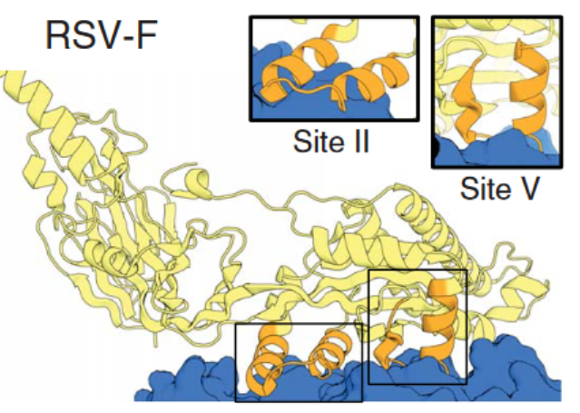
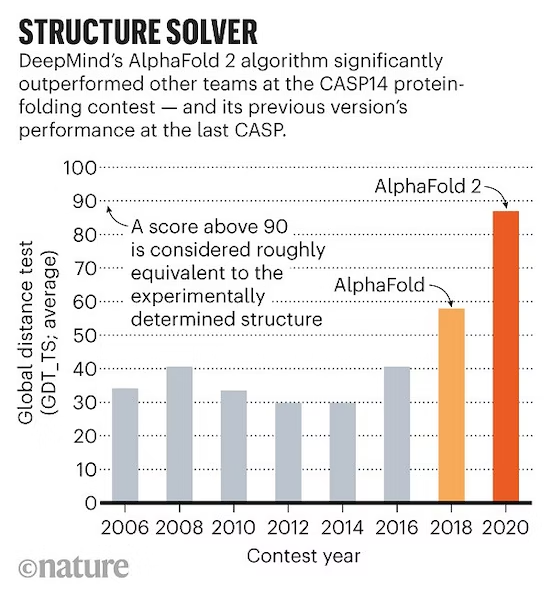

# Awesome AI-based Protein Design


This is a collection of research papers for **AI-based Protein Design**.
And the repository will be continuously updated to track the frontier of AI-based protein design.

Welcome to follow and star!


## Table of Contents

- [A Overview / Example of AI-based Protein Design](#a-Overview/Example-of-AI-based-Protein-Design)
- [Papers](#papers)

  - [Nature](#nature) (**<font color="red">Important!!!</font>**)
  - [Nature Biomedical Engineering](#nature-biomedical-engineering)
  - [Nature Communications](#nature-communications)
  - [Nature Machine Intelligence](#nature-machine-intelligence)
  - [Science](#science)
  - [ICML, ICLR or NeurIPS 2022](#icml-iclr-or-neurips-2022)
  - [Arxiv or bioRxiv](#arxiv-or-biorxiv)
  - [Others](#others)
- [Contributing](#contributing)

## Overview of Protein Design

AI tools have solved the protein structure prediction problem. This problem derives the spatial structure from the amino acid sequence and achieves atomic-level prediction accuracy, such as [AlphaFold 2](https://www.nature.com/articles/s41586-021-03819-2). It combines previous protein structure prediction models to automatically learn protein design methods, thus truly serving human pharmaceutical needs.

 

The specific practices of protein design vary widely, and the problem definitions applicable to different design processes are also very different. Here are some examples: 

1. A problem of predicting amino acid sequences from spatial structure (the inverse of Alphafold), which assumes that the spatial structure of the desired protein can be derived through molecular dynamics simulations, etc.
2. A problem of protein structure completion problem for a given partial structure, such as the recent Science [1] by the famous David Baker group. This assumes that only partial structural matches can be found. 
3. Combination of the fitted energy function with MD simulation for protein design, such as the recent Nature [2] of Liu Haiyan's team in China.

In addition, many methods can be used for protein design, and the corresponding AI problem definitions are also very different. This article lists some high-level articles in AI-based protein design, which will be continuously updated in the future.


## Papers

```
format:
- [title](paper link) [links]
  - author1, author2, and author3...
  - publisher
  - keyword
```


### Nature

- [A backbone-centred energy function of neural networks for protein design](https://www.nature.com/articles/s41586-021-04383-5)
  - B Huang, Y Xu, X Hu, Y Liu, S Liao, J Zhang, C Huang
  - Keyword: energy function, MD simulation, backbone-centred

- [De novo protein design by deep network hallucination](https://www.nature.com/articles/s41586-021-04184-w)
  - Ivan Anishchenko, Samuel J. Pellock, Tamuka M. Chidyausiku, Theresa A. Ramelot, Sergey Ovchinnikov, Jingzhou Hao, Khushboo Bafna, Christoffer Norn, Alex Kang, Asim K. Bera, Frank DiMaio, Lauren Carter, Cameron M. Chow, Gaetano T. Montelione & David Baker 
  - Keywords: hallucination, inpainting, protein design
    
- [Design of protein-binding proteins from the target structure alone](https://www.nature.com/articles/s41586-022-04654-9)
  - Longxing Cao, Brian Coventry, Inna Goreshnik, Buwei Huang, William Sheffler, Joon Sung Park, Kevin M. Jude, Iva Marković, Rameshwar U. Kadam, Koen H. G. Verschueren, Kenneth Verstraete, Scott Thomas Russell Walsh, Nathaniel Bennett, Ashish Phal, Aerin Yang, Lisa Kozodoy, Michelle DeWitt, Lora Picton, Lauren Miller, Eva-Maria Strauch, Nicholas D. DeBouver, Allison Pires, Asim K. Bera, Samer Halabiya, Bradley Hammerson, Wei Yang, Steffen Bernard, Lance Stewart, Ian A. Wilson, Hannele Ruohola-Baker, Joseph Schlessinger, Sangwon Lee, Savvas N. Savvides, K. Christopher Garcia & David Baker 
  - Keywords: binding cite
  

### Nature Biomedical Engineering

- [Accelerated antimicrobial discovery via deep generative models and molecular dynamics simulations](https://www.nature.com/articles/s41551-021-00689-x?from=article_link)
  - Payel Das, Tom Sercu, Kahini Wadhawan, Inkit Padhi, Sebastian Gehrmann, Flaviu Cipcigan, Vijil Chenthamarakshan, Hendrik Strobelt, Cicero dos Santos, Pin-Yu Chen, Yi Yan Yang, Jeremy P. K. Tan, James Hedrick, Jason Crain & Aleksandra Mojsilovic 
  - Keywords: antimicrobials, generative autoencoder, molecular dynamics
  

### Nature Communications

- [Discovering de novo peptide substrates for enzymes using machine learning](https://www.nature.com/articles/s41467-018-07717-6)
  - Lorillee Tallorin, JiaLei Wang, Woojoo E. Kim, Swagat Sahu, Nicolas M. Kosa, Pu Yang, Matthew Thompson, Michael K. Gilson, Peter I. Frazier, Michael D. Burkart & Nathan C. Gianneschi
  - Keywords: enzymes design, machine learning

- [ECNet is an evolutionary context-integrated deep learning framework for protein engineering](https://www.nature.com/articles/s41467-021-25976-8)
  - Yunan Luo, Guangde Jiang, Tianhao Yu, Yang Liu, Lam Vo, Hantian Ding, Yufeng Su, Wesley Wei Qian, Huimin Zhao & Jian Peng 
  - Keywords: functional fitness, evolutionary 
  
- [Protein design and variant prediction using autoregressive generative models](https://www.nature.com/articles/s41467-021-22732-w)
  - Jung-Eun Shin, Adam J. Riesselman, Aaron W. Kollasch, Conor McMahon, Elana Simon, Chris Sander, Aashish Manglik, Andrew C. Kruse & Debora S. Marks 
  - Keywords: autoregressive generative models, protein design
  
- [Protein sequence design with a learned potential](https://www.nature.com/articles/s41467-022-28313-9)
  - Namrata Anand, Raphael Eguchi, Irimpan I. Mathews, Carla P. Perez, Alexander Derry, Russ B. Altman & Po-Ssu Huang 
  - Keywords: protein design, energy function, deep neural network
  
- [Protein design and variant prediction using autoregressive generative models](https://www.nature.com/articles/s41467-021-22732-w)
  - Jung-Eun Shin, Adam J. Riesselman, Aaron W. Kollasch, Conor McMahon, Elana Simon, Chris Sander, Aashish Manglik, Andrew C. Kruse & Debora S. Marks 
  - Keywords: autoregressive generative models, protein design
  

### Nature Machine Intelligence
- [Regression Transformer enables concurrent sequence regression and generation for molecular language modelling](https://www.nature.com/articles/s42256-023-00639-z)
  - Jannis Born & Matteo Manica
  - Keywords: molecular language modelling, regression, transformer

- [Controllable protein design with language models](https://www.nature.com/articles/s42256-022-00499-z)
  - Noelia Ferruz & Birte Höcker 
  - Keywords: language model, controllable, survey


### Science

- [Robust deep learning based protein sequence design using ProteinMPNN](https://www.science.org/doi/abs/10.1126/science.add2187)
  -  J. Dauparas,  I. Anishchenko,  N. Bennett,  H. Bai,  R. J. Ragotte,  L. F. Milles,  B. I. M. Wicky,  A. Courbet, R. J. de Haas,  N. Bethel,  P. J. Y. Leung,  T. F. Huddy,  S. Pellock,  D. Tischer,  F. Chan,  B. Koepnick, H. Nguyen, A. Kang,  B. Sankaran,  A. K. Bera, N. P. King,  D. Baker
  - Keywords: language model, structure prediction
  
- [Scaffolding protein functional sites using deep learning](https://www.science.org/doi/abs/10.1126/science.abn2100)
  -  Jue Wang, Sidney Lisanza, David Juergens, Doug Tischer, Joseph L. Watson, Karla M. Castro, Robert Ragotte, Amijai Saragovi, Lukas F. Milles, Minkyung Baek, Ivan Anishchenko, Wei Yang, Derrick R. Hicks, Marc Expòsit, Thomas Schlichthaerle, Jung-Ho Chun, Justas Dauparas, Nathaniel Bennett, Basile I. M. Wicky, Andrew Muenks, Frank DiMaio, Bruno Correia, Sergey Ovchinnikov, David Baker
  - Keywords: functional site, deep learning, hallucination, inpainting
  

### ICML, ICLR or NeurIPS

- [BERTology Meets Biology: Interpreting Attention in Protein Language Models](https://arxiv.org/abs/2006.15222)
  - Jesse Vig, Ali Madani, Lav R. Varshney, Caiming Xiong, Richard Socher, Nazneen Fatema Rajani
  - Keywords: language model, transformer, structural and functional property

- [Conditional Antibody Design as 3D Equivariant Graph Translation](https://arxiv.org/abs/2208.06073)
  - Xiangzhe Kong, Wenbing Huang, Yang Liu
  - Keywords: antibody design, graph translation

- [Conditioning by adaptive sampling for robust design](http://proceedings.mlr.press/v97/brookes19a.html)
  - David Brookes, Hahnbeom Park, Jennifer Listgarten 
  - Keywords: adaptive sampling, protein design
  
- [Deep generative models create new and diverse protein structures](https://www.mlsb.io/papers_2021/MLSB2021_Deep_generative_models_create.pdf)
  - Zeming Lin, Tom Sercu,  Yann LeCun
  - Keywords: diversity, generative model, protein design

- [Deep sharpening of topological features for de novo protein design](https://openreview.net/forum?id=DwN81YIXGQP)
  - Zander Harteveld, Joshua Southern, Michaël Defferrard, Andreas Loukas, Pierre Vandergheynst, Micheal Bronstein, Bruno Correia
  - Keywords: variational autoencoder, topological features, sharpen
  
- [Fold2Seq: A Joint Sequence(1D)-Fold(3D) Embedding-based Generative Model for Protein Design](https://proceedings.mlr.press/v139/cao21a.html)
  - Yue Cao, Payel Das, Vijil Chenthamarakshan, Pin-Yu Chen, Igor Melnyk, Yang Shen
  - Keywords: generative model, protein design
  
- [Generative modeling for protein structures](https://proceedings.neurips.cc/paper/2018/hash/afa299a4d1d8c52e75dd8a24c3ce534f-Abstract.html)
  - Namrata Anand, Possu Huang
  - Keywords: generative model, protein design
  
- [Generative Models for Graph-Based Protein Design](https://proceedings.neurips.cc/paper/2019/hash/f3a4ff4839c56a5f460c88cce3666a2b-Abstract.html)
  - John Ingraham, Vikas Garg, Regina Barzilay, Tommi Jaakkola
  - Keywords: generative model, protein design

- [Model-based reinforcement learning for biological sequence design](https://openreview.net/forum?id=HklxbgBKvr&fileGuid=3xgr169o12oUrbxS&ref=https://githubhelp.com)
  - XChristof Angermueller, David Dohan, David Belanger, Ramya Deshpande, Kevin Murphy, Lucy Colwell
  - Keywords: reinforcement learning, sequence design

- [Molecule Generation For Target Protein Binding with Structural Motifs](https://openreview.net/forum?id=Rq13idF0F73)
  - Zaixi Zhang, Yaosen Min, Shuxin Zheng, Qi Liu
  - Keywords: target protein, structural motifs, fragment-by-fragment generation


### Arxiv or bioRxiv

- [A high-level programming language for generative protein design](https://www.biorxiv.org/content/10.1101/2022.12.21.521526v1.abstract)
  - Brian Hie, Salvatore Candido, Zeming Lin, Ori Kabeli, Roshan Rao, Nikita Smetanin, Tom Sercu, Alexander Rives
  - Keywords: ESMFold, language model, energy-based
  
- [Broadly applicable and accurate protein design by integrating structure prediction networks and diffusion generative models](https://www.biorxiv.org/content/10.1101/2022.12.09.519842v2.abstract)
  - Joseph L. Watson,  David Juergens,  Nathaniel R. Bennett,  Brian L. Trippe,  Jason Yim,  Helen E. Eisenach, Woody Ahern,  Andrew J. Borst,  Robert J. Ragotte,  Lukas F. Milles,  Basile I. M. Wicky,  Nikita Hanikel, Samuel J. Pellock,  Alexis Courbet, William Sheffler,  Jue Wang, Preetham Venkatesh,  Isaac Sappington, Susana Vázquez Torres,  Anna Lauko,  Valentin De Bortoli, Emile Mathieu, Regina Barzilay,  Tommi S. Jaakkola,  Frank DiMaio,  Minkyung Baek,  David Baker
  - Keywords: diffusion, general deep learning framework, de novo binder design
  
- [Function-guided protein design by deep manifold sampling](https://www.biorxiv.org/content/10.1101/2021.12.22.473759v1)
  - Vladimir Gligorijević, Daniel Berenberg, Stephen Ra, Simon Kelow, Kyunghyun Cho
  - Keywords: sequence denoising autoencoder, deep manifold sampling
  
- [Language models generalize beyond natural proteins](https://www.biorxiv.org/content/10.1101/2022.12.21.521521v1.abstract)
  - Robert Verkuil, Ori Kabeli, Yilun Du, Basile I. M. Wicky, Lukas F. Milles, Justas Dauparas, David Baker, Sergey Ovchinnikov, Tom Sercu, Alexander Rives
  - Keywords: ESMFold, language model, fixed backbone design
  
- [Language models of protein sequences at the scale of evolution enable accurate structure prediction](https://www.biorxiv.org/content/10.1101/2022.07.20.500902.abstract)
  - Zeming Lin, Halil Akin, Roshan Rao, Brian Hie, Zhongkai Zhu, Wenting Lu, Allan dos Santos Costa, Maryam Fazel-Zarandi, Tom Sercu, Sal Candido, Alexander Rives
  - Keywords: structure prediction, language model
  
- [TERMinator: A Neural Framework for Structure-Based Protein Design using Tertiary Repeating Motifs](https://arxiv.org/abs/2204.13048)
  - Alex J. Li, Vikram Sundar, Gevorg Grigoryan, Amy E. Keating
  - Keywords: protein design, tertiary motifs 
  

### Others

- [Fast and Flexible Protein Design Using Deep Graph Neural Networks](https://www.sciencedirect.com/science/article/pii/S2405471220303276)
  - Alexey Strokach, David Becerra, Carles Corbi-Verge, Albert Perez-Riba, Philip M.Kim
  - Keywords: protein design, graph neural network
  
- [Protein design and variant prediction using autoregressive generative models](https://www.nature.com/articles/s41467-021-22732-w)
  - Jung-Eun Shin, Adam J. Riesselman, Aaron W. Kollasch, Conor McMahon, Elana Simon, Chris Sander, Aashish Manglik, Andrew C. Kruse & Debora S. Marks 
  - Keywords: variant prediction, protein design, autoregressive generative models
  
  
## Reference

[1] Wang, Jue, et al. ["Scaffolding protein functional sites using deep learning." Science 377.6604 (2022): 387-394.](https://www.science.org/doi/abs/10.1126/science.abn2100)

[2] Huang, Bin, et al. ["A backbone-centred energy function of neural networks for protein design." Nature 602.7897 (2022): 523-528. ](https://www.nature.com/articles/s41586-021-04383-5)

## Contributing

Our purpose is to make this repo even better. If you are interested in contributing, please refer to [HERE](CONTRIBUTING.md) for instructions in contribution.

## License

awesome AI-based protein design is released under the Apache 2.0 license.
